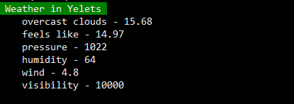

## Console application for tracking weather conditions

### DOCUMENTATION

**weather -h** - getting available list of commands

**weather -s [CITY_NAME]** - set target city for tracking

**weather -t [TOKEN]** - set weather api token

**weather** - see the current forecast

_You can get weather api token here for free_ - https://openweathermap.org/api

**npm** - https://www.npmjs.com/package/weather-forecast-sli
